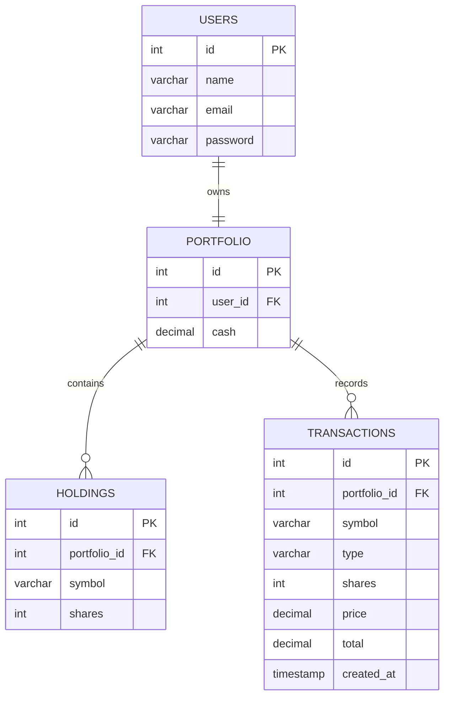

# TradeWise

TradeWise is a stock portfolio management application that simulates buying and tracking investments. The project focuses on building a backend system that manages portfolios, stock holdings, transactions, and real-time stock prices.

## Features

- Retrieve real-time stock prices using Alpha Vantage API
- Buy stocks and update portfolio balance
- Track current stock holdings
- Store transaction history
- Manage portfolio data with PostgreSQL

## Database Design

TradeWise uses a relational PostgreSQL database to organize users, portfolios, holdings, and transactions.



## Technologies

- Node.js
- Express.js
- PostgreSQL
- JavaScript
- Alpha Vantage API
- Git/GitHub

## Running Locally

Clone the repository:

```bash
git clone https://github.com/fuzislit/TradeWise.git
```

Navigate to the backend:

```bash
cd server
```

Install dependencies:

```bash
npm install
```

Create a `.env` file:

```env
ALPHA_VANTAGE_API_KEY=your_api_key_here
```

Start the server:

```bash
node index.js
```

The backend will run on:

```
http://localhost:3000
```

## Future Improvements

- User authentication
- Stock selling functionality
- Frontend dashboard
- Portfolio performance tracking